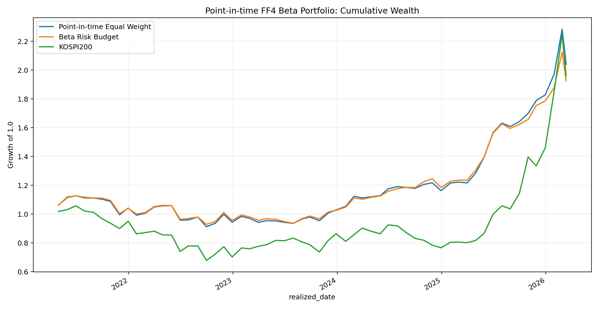
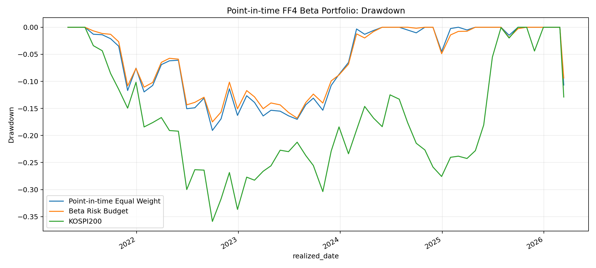
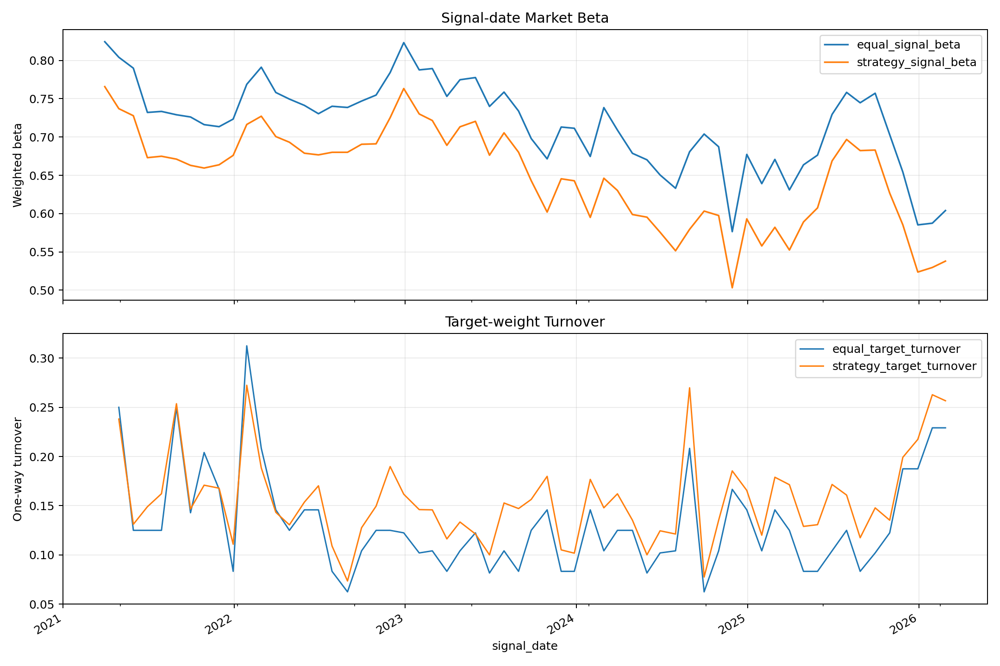

# MS와 EGARCH-X로 변동성 레짐 분석 및 FF4_beta_포트폴리오

`Defensive_ANDCashFilter_최종.ipynb`를 중심으로 정리한 방어형 포트폴리오와 AND Cash Filter 백테스트 연구 노트북입니다.

## 핵심 질문

공격/방어 스위칭보다 방어형 포트폴리오를 유지하면서, EGARCH-X와 Markov Switching이 동시에 극단 위험 신호를 줄 때만 현금 대기하는 방식이 성과와 낙폭 관리에 더 유리한지 확인합니다.

## Point-in-time AI 비중조절 확장

`src/ai_beta_reweight_backtest.py`는 기존의 FF4 방어주 선택을 미래정보 없이 다시 계산하고, 동일가중 포트폴리오를 베타 위험예산 방식으로 조절합니다. LLM이 종목별 비중이나 미래수익률을 직접 생성하지 않도록 역할을 제한했습니다.

1. 매월 신호일 현재의 가격·시가총액·FF4 데이터만 사용합니다.
2. 시가총액 상위 300개 종목에서 252거래일 롤링 FF4 베타를 추정합니다.
3. 시장·규모·가치 베타와 시장베타 표준오차로 방어 점수를 계산하고 상위 20%를 선택합니다.
4. 정책 계수는 시장베타, 추정 불확실성, 최근 변동성에 대한 페널티만 결정합니다.
5. 최종 비중은 롱온리·합계 100%·종목당 동일가중의 0.5~1.75배 제약 아래 결정론적으로 계산합니다.
6. 신호일 `t`의 비중은 오직 `(t, 다음 리밸런싱일]` 수익률에 적용합니다.

전체 표본의 분위수를 이용한 전처리를 피하고, 극단치 완화 기준도 각 신호일의 252거래일 관측창 안에서만 계산합니다. 저장소에 거래대금 원본이 없으므로 새 확장에서는 당시 시가총액 상위 300개를 유동성 대용 기준으로 사용합니다.

### CLOVA Studio 연동 방식

NAVER Cloud의 CLOVA Studio Chat Completions v3와 HCX-007 Structured Outputs를 지원합니다. AI는 종목명이 아닌 당시 데이터의 분포 요약만 받고, 다음 네 가지 제한된 계수만 JSON으로 반환합니다.

- 시장베타 페널티
- 베타 추정 불확실성 페널티
- 최근 변동성 페널티
- 동일가중 대비 기울기 강도

비중은 매월 최신 베타로 다시 계산하지만 API 정책은 기본적으로 3개월마다 갱신합니다. 최근 5년 실행 시 API 호출은 약 20회입니다. API 키는 환경변수에서만 읽으며 저장소나 출력 파일에 기록하지 않습니다.

```bash
export CLOVASTUDIO_API_KEY="발급받은_API_KEY"
python src/ai_beta_reweight_backtest.py \
  --policy clova \
  --years 5 \
  --api-frequency-months 3
```

[CLOVA Studio API 개요](https://api.ncloud-docs.com/docs/ai-naver-clovastudio-summary) · [HCX-007 Structured Outputs](https://api.ncloud-docs.com/docs/clovastudio-chatcompletionsv3-so)

현재 저장된 결과는 API 키 없이 재현 가능한 결정론적 위험예산 기준선입니다. HCX-007의 실제 응답을 사용한 결과로 오인하지 않도록 `policy_source=deterministic`을 결과 테이블에 명시했습니다.

### 최근 5년 결과

기간은 2021-03-31 신호부터 2026-03-13 실현 수익률까지 총 60개월입니다. 거래비용 차감 전 결과입니다.

| 지표 | Point-in-time 동일가중 | 베타 위험예산 | KOSPI200 |
| --- | ---: | ---: | ---: |
| CAGR | 15.32% | 14.01% | 14.39% |
| 연환산 변동성 | 16.16% | 14.56% | 26.93% |
| Sharpe (무위험수익률 차감) | 0.804 | 0.797 | 0.531 |
| 최대낙폭 | -19.07% | -17.50% | -35.89% |
| 총수익률 | 103.99% | 92.60% | 95.87% |
| 평균 신호일 시장베타 | 0.717 | 0.650 | - |
| 평균 목표비중 회전율 | 13.20% | 15.61% | - |

베타 위험예산은 동일가중보다 CAGR과 Sharpe가 소폭 낮았지만, 연환산 변동성·최대낙폭·평균 시장베타를 줄였습니다. 따라서 현재 결과는 수익률 개선 모델이 아니라 방어 강도를 명시적으로 조절하는 위험관리 확장으로 해석해야 합니다. 회전율이 더 높아 거래비용 반영 시 성과 차이가 불리해질 수 있습니다.







### 미래정보 방지 감사

`output/tables/ai_beta_lookahead_audit.csv`에서 모든 월에 대해 다음 조건을 확인합니다.

- `max_input_date <= signal_date`
- `holding_start > signal_date`
- 성과 시계열은 신호일이 아니라 실제 보유기간 종료일인 `realized_date`로 저장
- 회귀·성과 검증 전 `signal_date → realized_date` 입력 미리보기 출력

## 주요 파일

| 파일 | 설명 |
| --- | --- |
| `Defensive_ANDCashFilter_최종.ipynb` | 최종 정리 노트북 |
| `DefensiveOnly_FF4_베타_포트폴리오.ipynb` | Defensive Only 전략 실험 노트북 |
| `Defensive_CashFilter_실험.ipynb` | Cash Filter 실험 노트북 |
| `EGARCH-t_변동성예측_FF4_베타_포트폴리오.ipynb` | EGARCH 기반 변동성 예측 실험 |
| `(+Volume,MarkovSwitching)EGARCH-t_변동성예측_FF4_베타_포트폴리오.ipynb` | 거래량과 Markov Switching을 더한 실험 |
| `src/ai_beta_reweight_backtest.py` | Point-in-time FF4 베타 비중조절 및 CLOVA Studio 정책 연동 |

## 추가 심화 활동

| 파일 | 설명 |
| --- | --- |
| `advanced-activities/메인전략_ParticipationStabilityTop30_Weekly_EGARCH7030.ipynb` | Participation-Stability Top30 주간 리밸런싱 전략에 EGARCH 기반 100/70/30 시장 비중 오버레이를 적용한 심화 활동 노트북 |

이 심화 활동 노트북은 별도 AI Finance 실험 폴더의 저장 데이터(`garch_roll_params.csv`, `ff4_beta_store`, `gemini_ai_score_cache_5y.csv` 등)를 전제로 한 정리본입니다. 100MB를 넘는 중간 산출물은 GitHub 일반 파일 제한 때문에 repo에는 포함하지 않았습니다.

## 공개 데이터 정책

공개 전환 과정에서 가격·시가총액·거래량·FF4 요인의 원본 데이터는 저장소와 공개 Git 이력에서 제거했습니다. 공개 저장소에는 코드, 합성 샘플 스키마, 생성 방법, 실행 결과와 차트만 포함합니다.

합성 샘플은 다음 명령으로 다시 만들 수 있습니다.

```bash
python scripts/generate_sample_data.py
```

`sample_data/README.md`에서 공개 샘플과 비공개 원본 입력 사이의 열 구조를 확인할 수 있습니다. 샘플 값은 인위적으로 생성했으며 공개된 백테스트 결과에는 사용하지 않았습니다.

전략 재실행에 필요한 비공개 입력 구조는 다음과 같습니다.

| 파일 | 용도 |
| --- | --- |
| `2000_2026_코스피코스닥_수정주가_일별_비영업일제외.csv` | 개별 종목 수정주가 |
| `2000_2026_코스피200_일별_거래량_비영업일제외.csv` | KOSPI200 거래량 프록시 |
| `2000_2026_코스피코스닥_시가총액_일별_비영업일제외.csv` | 시가총액 필터 |
| `2000_2026_KOSPI200, SMB, HML, MOM_수정종가_91CD_알별_비영업일제외.csv` | FF4 요인과 CD91 금리 |

원본 데이터는 적법한 사용 권한을 가진 사용자가 로컬에서 준비해야 하며 Git에 추가되지 않도록 `.gitignore`에 등록했습니다.

## 실행 환경

```bash
pip install -r requirements.txt
jupyter notebook
```

그 다음 `Defensive_ANDCashFilter_최종.ipynb`를 열어 순서대로 실행합니다.

최근 5년 Point-in-time 비중조절 기준선은 다음 명령으로 재현합니다.

```bash
python src/ai_beta_reweight_backtest.py --policy deterministic --years 5
```

## 산출물

노트북 실행 후 주요 중간 결과와 비교 결과가 CSV로 저장됩니다.

- `def_rank.csv`
- `def_selected.csv`
- `cash_filter_final_compare_perf.csv`
- `cash_filter_final_compare_returns.csv`
- `egarch_eval.csv`
- `egarch_summary.csv`
- `hybrid_regime_compare.csv`
- `regime_model_compare.csv`
- `output/tables/ai_beta_monthly_returns.csv`
- `output/tables/ai_beta_performance.csv`
- `output/tables/ai_beta_policy_decisions.csv`
- `output/tables/ai_beta_lookahead_audit.csv`
- `output/tables/ai_beta_latest_weights.csv`

## 주의

- 연구 및 백테스트 목적의 정리본입니다.
- 과거 데이터 기반 결과이며 투자 성과를 보장하지 않습니다.
- 공개된 CSV와 PNG는 전략의 파생 산출물이며, 합성 샘플은 입력 스키마 설명용입니다.
